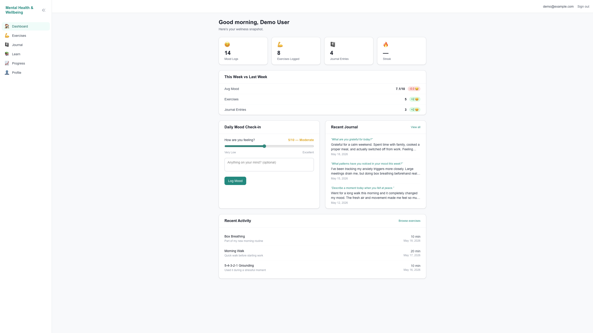

# Mental Health & Wellbeing App

A full-stack mental wellness tracking application built with Next.js and Supabase. Users can log their daily mood, track exercise sessions, write journal entries, and explore evidence-based mental health education, all in one place.

> **Live demo:** [mental-health-wellness-app-delta.vercel.app](mental-health-wellness-app-delta.vercel.app)

---

## Features

- **Mood tracking** — Daily check-in with a 1–10 score and optional note. Streak tracking and weekly comparisons show progress over time.
- **Exercise logging** — Browse a library of physical, breathing, CBT, and mindfulness exercises. Log sessions with duration and notes.
- **Journal** — Private journaling with optional guided prompts and full-text search across past entries.
- **Education** — Evidence-based mental health facts grouped by topic, each with peer-reviewed citations and source links.
- **Progress** — Recharts-powered mood and exercise visualizations with 7-day, 30-day, and all-time filters. Includes a mood/exercise correlation insight.
- **Weekly summary** — Dashboard card comparing this week's avg mood, exercise sessions, and journal entries against last week.
- **Data export** — Download all personal data as a CSV from the profile page.
- **Demo mode** — One-click demo that resets a shared account to clean seed data on every visit, no sign-up required.
- **Authentication** — Email/password sign-up and login, forgot password flow with PKCE-based reset, protected routes via Next.js middleware.

---

## Tech Stack

| Layer | Technology |
|---|---|
| Framework | Next.js 15 (App Router, Server Components, Server Actions) |
| Language | TypeScript |
| Database | Supabase (PostgreSQL) |
| Auth | Supabase Auth |
| Styling | Tailwind CSS v4 |
| Charts | Recharts |
| Deployment | Vercel |

---

## Architecture Highlights

- **Server Components** for all data fetching — no `useEffect` data loading, no client waterfalls
- **Server Actions** for all mutations (`logMood`, `logExercise`, `saveJournalEntry`, `deleteAccount`, etc.)
- **Row Level Security** on all user tables — users can only read and write their own data
- **Middleware** for route protection — unauthenticated users are redirected before any page renders
- **Responsive layout** — collapsible desktop sidebar + mobile slide-in drawer, managed by a shared `AppShell` client component

## Preview of Dashboard
